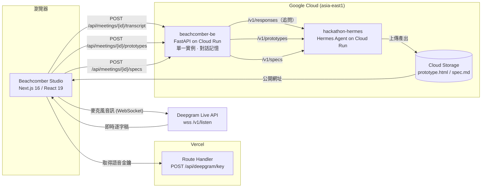

# Beachcomber — 需求訪談即時 Prototype 產生器

> 本 repo（`beachcomber-fe`）是作品的主要入口。後端與 AI 服務分別在
> [`beachcomber-be`](https://github.com/The-Beachcomber/beachcomber-be)、
> [`hackathon-hermes`](https://github.com/The-Beachcomber/hackathon-hermes)。

## 問題與目標

需求訪談的痛點不在「聽不懂」，而在**當下漏問**與**事後轉譯失真**。PM 訪談完客戶，靠記憶與零散筆記寫成規格，工程師再依規格想像畫面，等到第一版 Demo 出來、客戶說「我要的不是這個」，時程已經燒掉數週。

Beachcomber 把這段延遲壓縮到訪談當下：訪談進行中即時轉逐字稿、由 AI 產出「接下來該追問什麼」，讓漏掉的需求在客戶還在場時就補齊；訪談結束後，同一份逐字稿直接產出**可以點的 HTML Prototype** 與 **PM / UI / Engineering / QA 四份角色 Spec**，讓「客戶說的」與「團隊做的」在同一次會議內對齊。

目標使用者是需要跟客戶／利害關係人做需求訪談的 PM、SA 與顧問。預期影響是把「訪談 → 需求確認 → 可視化」從數天縮短到數分鐘。

## 核心功能

- **即時語音逐字稿**：透過 Deepgram Live（`nova-3`、`zh-TW`）邊講邊上字，支援 interim results 與標點自動補齊。
- **AI 追問卡**：逐字稿送出後回傳建議追問問題，同一場訪談以 `meeting_id` 串起對話記憶，第二輪會接著第一輪往下追，而不是重問。
- **一鍵產 Prototype**：同一份逐字稿產出單檔可互動的繁中 HTML（CSS/JS/資料全部 inline、零外部資源），上傳 GCS 後回公開網址，可直接嵌 `<iframe>` 預覽。實測 20～40 秒。
- **四角色 Spec 產出**：勾選 PM / UI / Engineering / QA，一次呼叫產齊四份 Markdown 規格並回公開網址，`SpecViewer` 直接預覽與複製連結。實測 63～68 秒。
- **Session 管理**：側欄保留訪談 session 清單、自動命名、逐字稿與追問卡狀態（目前為前端本地狀態，串接點見 `docs/api-integration-map.md`）。

## 系統架構



各層職責：

| 層 | 做什麼 | 不做什麼 |
| --- | --- | --- |
| **前端** `beachcomber-fe` | 錄音與 Deepgram 串流、逐字稿編輯、追問卡互動、Prototype／Spec 預覽；以 Route Handler 從環境變數下發語音金鑰 | 不直接呼叫 AI 模型 |
| **後端** `beachcomber-be` | 轉換前後端資料形狀、以 `meeting_id` 保存訪談記憶（問過哪些題、Hermes 對話 ID）、重試與錯誤分類 | 不自行組 Prototype／Spec 提示詞、不碰 Hermes 檔案系統 |
| **AI 服務** `hackathon-hermes` | Hermes agent 的公開包裝層，內含追問／Prototype／Spec 的提示詞與四角色技能設定，產出後上傳 GCS | 不對外驗證身分（Demo 用，正式環境須收回） |
| **儲存** GCS | 存放產出的 HTML Prototype 與四份 Markdown Spec，提供公開讀取網址 | — |

> ⚠️ 後端的對話記憶存在 process 記憶體，因此 Cloud Run **必須設 `--min-instances=1 --max-instances=1`**；多實例會讓請求落到沒看過前幾輪的實例上，不報錯但每輪都退化成「第一輪」。

## 使用技術

| 類型 | 技術／服務 | 用途 |
| --- | --- | --- |
| AI 模型 | Hermes Agent Platform（`/v1/responses`、`/v1/prototypes`、`/v1/specs`） | 產出追問問題、HTML Prototype 與四角色 Spec |
| AI 模型 | Deepgram `nova-3`（zh-TW） | 即時語音辨識（STT） |
| 前端 | Next.js 16 / React 19 / TypeScript 5 | App Router 單頁工作台、語音金鑰 Route Handler |
| 前端 | Tailwind CSS 4、framer-motion | 版面與動態效果 |
| 後端 | Python + FastAPI（uv 管理相依） | 三支訪談 API、對話記憶、重試與錯誤分類 |
| 後端 | aiohttp | Hermes 公開包裝層（`public_startup.py`） |
| 基礎設施 | Google Cloud Run（asia-east1）、Cloud Storage、Artifact Registry | 後端與 AI 服務部署、產出檔案託管 |
| 基礎設施 | Vercel | 前端部署 |
| Sponsor 技術 | TODO：請填入本次活動 sponsor 提供的技術與對應用途 | TODO |

## 安裝與執行

### 前端（本 repo）

```bash
git clone https://github.com/The-Beachcomber/beachcomber-fe.git
cd beachcomber-fe
npm install

# 語音辨識需要 Deepgram 金鑰，由 server 端讀取、不會寫進原始碼
echo "DEEPGRAM_API_KEY=<your-deepgram-api-key>" > .env.local

npm run dev
# 開 http://localhost:3000
```

前端預設直接呼叫已部署的後端（`https://beachcomber-be-1021189182492.asia-east1.run.app`），因此只跑前端即可完成完整流程。要改打本機後端，請調整 `lib/api/` 底下的 base URL。

沒有設 `DEEPGRAM_API_KEY` 時，`POST /api/deepgram/key` 會回 `503`，錄音功能停用，其餘功能不受影響。

### 後端（選用，本機開發時）

```bash
git clone https://github.com/The-Beachcomber/beachcomber-be.git
cd beachcomber-be
uv sync
uv run uvicorn main:app --reload --port 8000
# API 文件 http://localhost:8000/docs
```

不想連真的 Hermes 時，設 `USE_MOCK_HERMES=true` 會回固定假資料且不出網路。

部署到 Cloud Run（三個參數不可省，理由見上方架構說明）：

```bash
gcloud run deploy beachcomber-be \
  --source . \
  --region asia-east1 \
  --allow-unauthenticated \
  --min-instances=1 --max-instances=1 \
  --timeout=600 \
  --set-env-vars USE_MOCK_HERMES=false
```

## 作品展示

- 作品展示網址：https://beachcomber-fe.vercel.app
- 評選影片：TODO：請填入影片連結

## 限制與未來工作

**已知限制**

- **語音金鑰仍是長期金鑰**：金鑰已移出原始碼、改由 Route Handler 從環境變數下發，但回給瀏覽器的是原始 API key 而非短期 token，任何開得起頁面的人都能取得。正式使用應改為 Deepgram 的臨時金鑰機制。
- **訪談記憶不持久**：後端記憶存在 process 記憶體，重啟或多實例即遺失，因此 Cloud Run 被綁在單一實例、無法水平擴充。
- **追問不保證去重**：提示詞的規則是「已在逐字稿中得到明確答案才不再問」，因此語意相近的問題仍可能重複出現，UI 不能假設每輪問題互斥。
- **`verified_count` 恆為 0**：目前沒有事實查證機制，此欄位僅為介面預留。
- **Session 相關 API 尚未落地**：`lib/api/session.ts`、`prototype.ts`、`spec.ts` 中標註 `API TODO` 的函式仍回傳本地 Promise，重新整理後歷史紀錄不會保留；待接的端點清單見 `docs/api-integration-map.md`。
- **後端 CORS 全開、Hermes 無需驗證**：Demo 環境刻意如此，正式環境必須收斂 origin 並補上 auth header（`_post_prototype()` 與 `ask_specs()` 目前未送）。
- **產出時間偏長**：Prototype 約 20～40 秒、Spec 約 63～68 秒，目前以 loading state 處理，尚無串流式回饋。

**未來工作**

- Session／逐字稿／Prototype Archive 落地到資料庫，讓訪談紀錄可回溯與分享。
- Spec 匯出 PDF／Doc（`POST /api/specs/export` 已預留）。
- 多人同時參與同一場訪談（發言者分離、協作編輯逐字稿）。
- 依使用者回饋迭代 Prototype，而非每次從逐字稿重新產生。

## 第三方服務、資料與素材

| 項目 | 來源／連結 | 授權／使用方式 |
| --- | --- | --- |
| Deepgram Speech-to-Text | https://deepgram.com | 商業 API，依官方條款使用，需自備 API key（以環境變數提供，未進版控） |
| Hermes Agent Platform | 本次活動提供之 API Server（`hackathon-hermes` 為其公開包裝層） | 依活動提供之使用條款；TODO：確認正式名稱與授權標示 |
| Google Cloud Run / Cloud Storage | https://cloud.google.com | 商業雲端服務，依官方條款使用 |
| Vercel | https://vercel.com | 前端託管，依官方條款使用 |
| Next.js | https://github.com/vercel/next.js | MIT |
| React | https://github.com/facebook/react | MIT |
| Tailwind CSS | https://github.com/tailwindlabs/tailwindcss | MIT |
| framer-motion | https://github.com/motiondivision/motion | MIT |
| FastAPI | https://github.com/fastapi/fastapi | MIT |
| Geist 字型 | https://vercel.com/font | SIL Open Font License 1.1 |
| 圖示素材（`public/*.svg`） | Next.js／Vercel 官方範本 | 依 Next.js 專案授權 |

本 repo 不包含任何客戶真實資料；Demo 使用的逐字稿為自行撰寫的情境範例。

## 團隊成員

| 姓名 | 分工 |
| --- | --- |
| Fangyu Kung | 前端開發（TODO：確認完整分工） |
| TODO | TODO |

## License

TODO：本 repo 尚未加入 `LICENSE` 檔案。請於根目錄新增授權檔（例如 MIT），並在此標示授權名稱。
